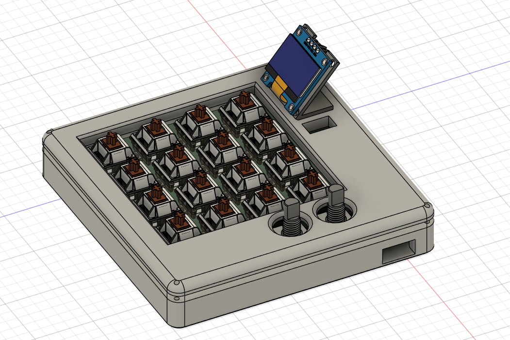
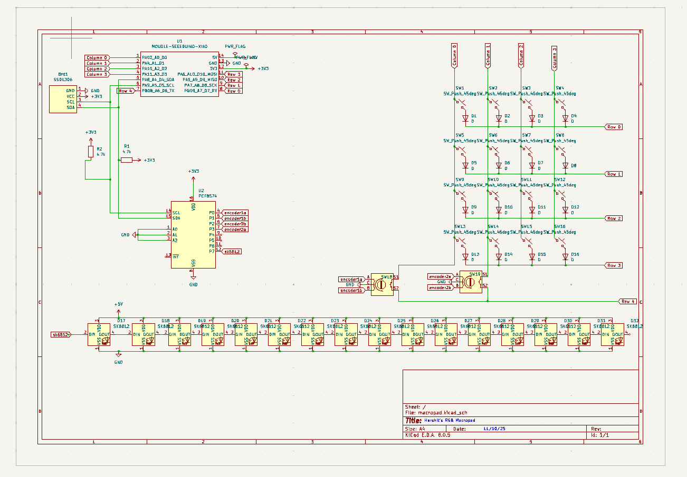

# HackPad

    This is my macropad for the HACKPAD YSWS program by hackclub. 

# Bill Of Materials

    Xiao RP2040
    PCF8574 IO expander
    SSD1306 0.96 OLED
    (2) 4.7k resistor
    (16) SK6812 LED
    (16) 1N4148 diodes
    (16) Cherry MX brown switches

    (16) any keycaps at hq
    (16) Mill-Max 0305s hotswap socket
    (2) any encoder knobs at hq
    (2) EC11 encoder
    
    --> Please laser cut the plate in 3mm clear acrylic and 3D print the rest of the pieces.

# My Model

# My schematic

